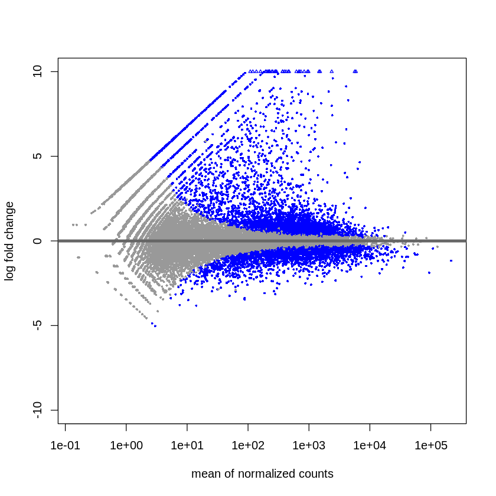

# hse21_hw3

Ссылка на колаб: https://colab.research.google.com/drive/1-o7-nCgJnHsRNKGXp49M3hKI3hhC005U#scrollTo=PqrxWk6VEex9

Обрботка и графики https://colab.research.google.com/drive/1OAlyTlVFBCllorI9mBfgj0Avg76ZHNJK?usp=sharing#scrollTo=-q6oLeL53JtS

## Качества данных из Multiqc
Полный файл по ссылке https://github.com/SvMixa/hse21_hw3/blob/main/multiqc_report.html

Все вычисления можно найти в коллабе. Таблицу с результатами можно увидеть ниже.

### Графики:
Heatmap

MA-plot

Первый

Второй

